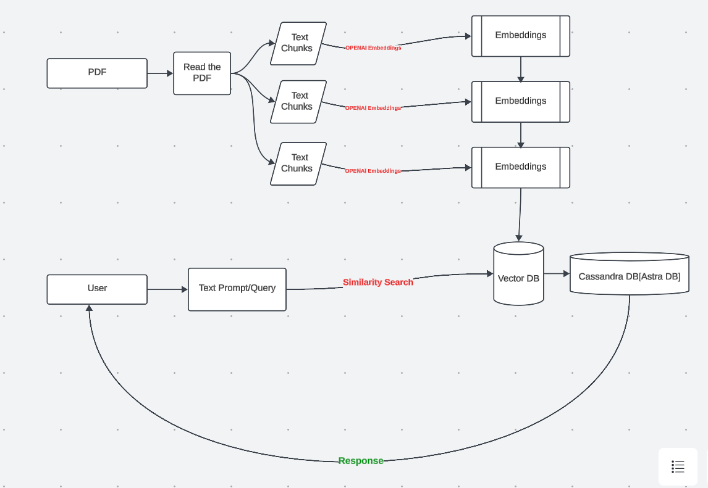

## PDF Query with LangChain and Cassandra Vector Store

### Overview
This project demonstrates how to use LangChain to build a question-answering system that can process and query the content of a PDF document. It leverages OpenAI's API for language processing and embedding, and uses Apache Cassandra as a vector store for efficient similarity searching.

### Requirements
- Python 3.7 or higher
- Required libraries:
    - `cassio`
    - `datasets`
    - `langchain`
    - `openai`
    - `tiktoken`
    - `PyPDF2`

### Installation
First, ensure you have the required Python libraries. You can install them using the following commands:

```bash
!pip install -q cassio datasets langchain openai tiktoken
!pip install pyPDF2
```

### Configuration
Ensure you have your Astra DB and OpenAI API credentials ready:
- `ASTRA_DB_APPLICATION_TOKEN`
- `ASTRA_DB_ID`
- `OPENAI_API_KEY`

Replace `YOUR_ASTRA_DB_TOKEN`, `YOUR_ASTRA_DB_ID`, and `YOUR_OPENAI_API_KEY` with your actual credentials within the code.

### Usage
1. **Import necessary libraries and set up configurations:**
   - Importing relevant modules for processing and querying.
   ```python
   from langchain.vectorstores.cassandra import Cassandra
   from langchain.indexes.vectorstore import VectorStoreIndexWrapper
   from langchain.llms import OpenAI
   from langchain.embeddings import OpenAIEmbeddings
   import cassio
   
   from PyPDF2 import PdfReader
   ```

2. **Read the PDF content:**
   - The `PdfReader` module is used to read 'Climate-report.pdf'.
   ```python
   pdfreader = PdfReader('Climate-report.pdf')
   
   raw_text = ''
   
   for i, page in enumerate(pdfreader.pages):
       content = page.extract_text()
       if content:
           raw_text += content
   ```

3. **Initialize the connection to Astra DB:**
   - Set up the connection using your credentials.
   ```python
   cassio.init(token=ASTRA_DB_APPLICATION_TOKEN, database_id=ASTRA_DB_ID)
   ```

4. **Setup OpenAI and Embedding configuration:**
   - Initialize OpenAI with API key and embeddings.
   ```python
   llm = OpenAI(openai_api_key=OPENAI_API_KEY)
   embedding = OpenAIEmbeddings(openai_api_key=OPENAI_API_KEY)
   ```

5. **Create and populate the vector store:**
   - Set up Cassandra as the vector store for the dataset.
   ```python
   astra_vector_store = Cassandra(
       embedding=embedding,
       table_name='pdfqueryproj',
       session=None,
       keyspace=None
   )
   ```

6. **Process the text into chunks:**
   - Split text into manageable chunks for vector storage.
   ```python
   from langchain.text_splitter import CharacterTextSplitter
   
   text_splitter = CharacterTextSplitter(
       separator="\n",
       chunk_size=800,
       chunk_overlap=200,
       length_function=len,
   )
   
   texts = text_splitter.split_text(raw_text)
   ```

7. **Add text datasets into the vector store**
   ```python
   astra_vector_store.add_texts(texts[:50])
   
   astra_vector_index = VectorStoreIndexWrapper(vectorstore=astra_vector_store)
   ```

8. **Query the data interactively:**
   - Use an interactive loop to query the data with user input.
   ```python
   first_question = True
   
   while True:
       if first_question:
           query_text = input("Enter your question..(type quit to exit): ").strip()
       else:
           query_text = input("\n What is your next question.. :").strip()
   
       if query_text.lower() == "quit":
           break
       if query_text.lower() == "":
           continue
       first_question = False
   
       print("\nQuestion: \"%s\"" % query_text)
       answer = astra_vector_index.query(query_text, llm=llm).strip()
       print("\nAnswer: \"%s\"\n" % answer)
   
       print("FIRST DOCUMENTS BY RELEVANCE: ")
       for doc, score in astra_vector_store.similarity_search_with_score(query_text, k=4):
           print("  [%0.4f] \"%s ...\"" % (score, doc.page_content[:84]))
   ```

### Conclusion
This project provides a robust solution for querying and extracting information from PDF documents by leveraging LangChain, OpenAI, and Cassandra.

### Architecture
- 

### Notes
- Make sure to replace placeholders for the tokens and IDs with actual values.
- Adjust the dataset and model configurations as needed for your specific use case.
- Ensure the PDF document path is correct and accessible within your environment.
